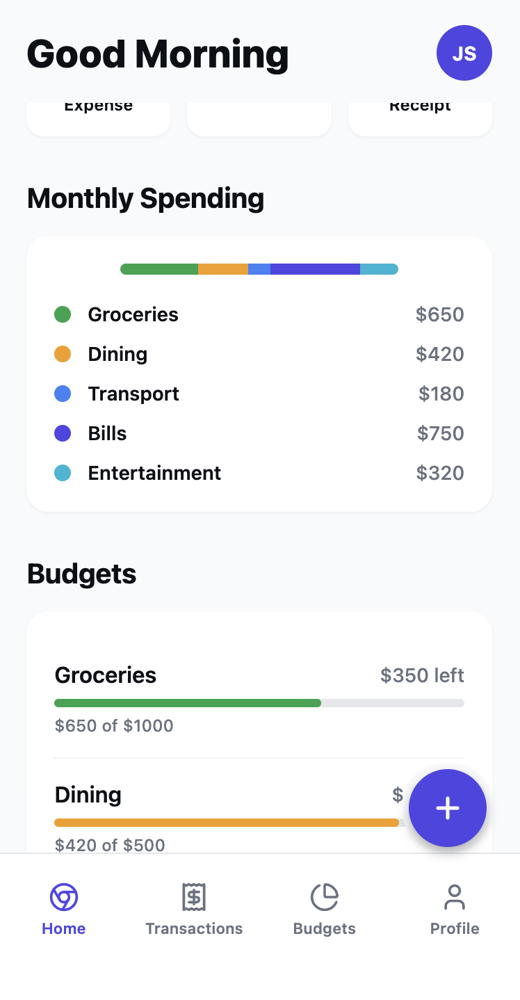
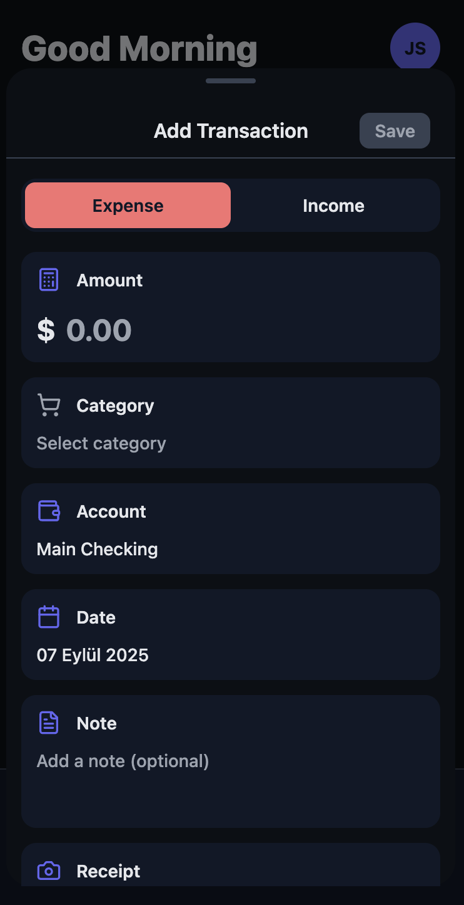
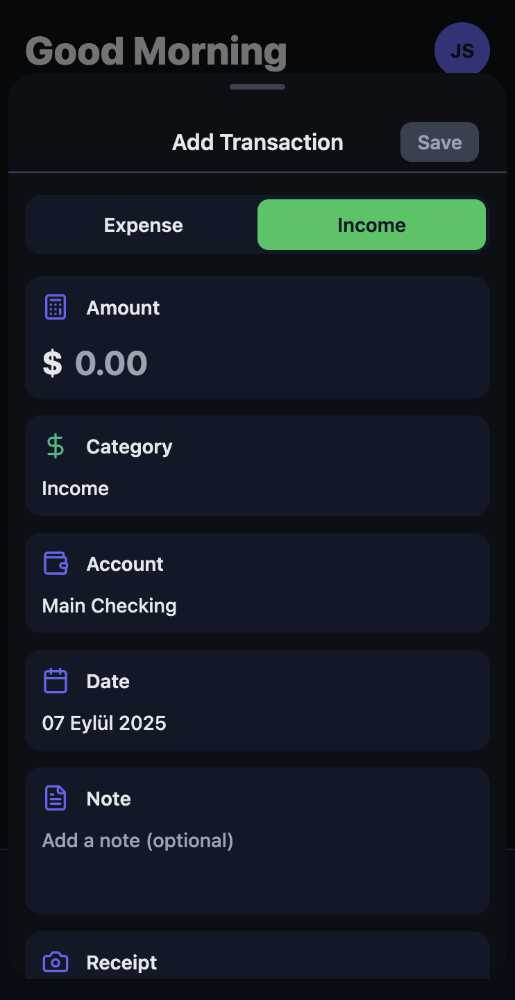
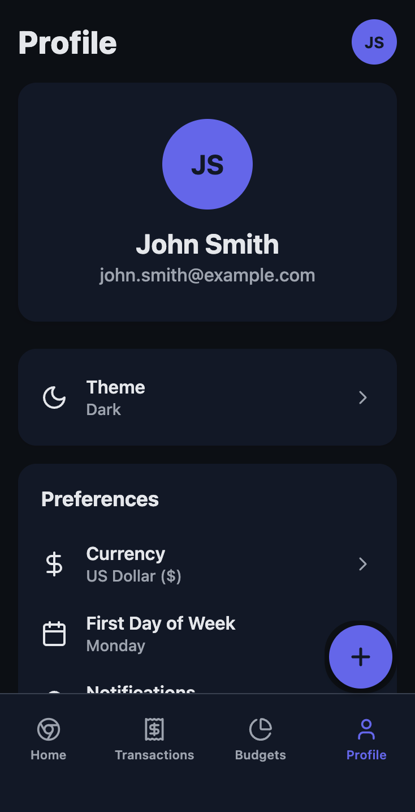

# Finora - Personal Finance Tracker

🚀 **[Live Demo](https://finora-personal-fina-hwth.bolt.host)**

## 📱 Screenshots

### Onboarding & Authentication
<div align="center">
  
  
  
</div>

<div align="center">
  
  
</div>

### Main Application
<div align="center">
  
  
  
</div>

<div align="center">
  
  
  
</div>

### Budget Management
<div align="center">
  
  
  
</div>

### Profile & Settings
<div align="center">
  
  
  
</div>

<div align="center">
  
</div>

A modern, intuitive personal finance tracking mobile application built with React Native and Expo. Finora helps you take control of your finances with intelligent expense tracking, budgeting tools, and insightful analytics.

## ✨ Features

- **Smart Financial Tracking**: Intelligent expense categorization and tracking
- **Multi-Account Management**: Support for checking, savings, and crypto accounts
- **Budget Management**: Create and monitor budgets with visual progress indicators
- **Transaction Management**: Easy transaction entry with receipt scanning capability
- **Real-time Analytics**: Visual spending charts and financial insights
- **Responsive Design**: Optimized for all screen sizes from mobile to desktop
- **Dark/Light Theme**: Automatic theme switching with system preference support
- **Secure Authentication**: Email/password authentication with demo account option

## 🛠️ Tech Stack

- **Framework**: React Native with Expo SDK 53
- **Navigation**: Expo Router v5
- **Language**: TypeScript
- **Styling**: StyleSheet with responsive design
- **Icons**: Lucide React Native
- **State Management**: React Context API
- **Platform**: Cross-platform (iOS, Android, Web)

## 🚀 Getting Started

### Prerequisites

- Node.js (v18 or higher)
- npm or yarn
- Expo CLI
- iOS Simulator (for iOS development)
- Android Studio (for Android development)

### Installation

1. Clone the repository:
```bash
git clone https://github.com/yourusername/finora-finance-tracker.git
cd finora-finance-tracker
```

2. Install dependencies:
```bash
npm install
```

3. Start the development server:
```bash
npm run dev
```

4. Open the app:
   - **iOS**: Press `i` to open iOS Simulator
   - **Android**: Press `a` to open Android Emulator
   - **Web**: Press `w` to open in web browser

## 📁 Project Structure

```
finora-finance-tracker/
├── app/                    # App screens and navigation
│   ├── (tabs)/            # Tab-based screens
│   ├── auth/              # Authentication screens
│   ├── _layout.tsx        # Root layout
│   └── onboarding.tsx     # Onboarding flow
├── components/            # Reusable UI components
├── contexts/              # React Context providers
├── hooks/                 # Custom React hooks
├── assets/                # Images and static assets
└── README.md
```

## 🎨 Design System

### Color Palette
- **Primary**: #4F46E5 (Indigo)
- **Success**: #16A34A (Green)
- **Warning**: #F59E0B (Amber)
- **Error**: #EF4444 (Red)
- **Info**: #3B82F6 (Blue)

### Typography
- **Headings**: 800 weight, responsive sizing
- **Body**: 500 weight, 16px base
- **Captions**: 500 weight, 14px

### Spacing
- **Base unit**: 4px
- **Component padding**: 16-24px
- **Section margins**: 20-32px

## 🔧 Configuration

### Environment Variables
Create a `.env` file in the root directory:

```env
EXPO_PUBLIC_API_URL=your_api_url
EXPO_PUBLIC_API_KEY=your_api_key
```

### Theme Configuration
The app supports automatic theme switching based on system preferences. You can customize themes in `contexts/ThemeContext.tsx`.

## 📱 Platform Support

- **iOS**: Full native support
- **Android**: Full native support  
- **Web**: Responsive web application
- **Desktop**: PWA support

## 🤝 Contributing

1. Fork the repository
2. Create your feature branch (`git checkout -b feature/AmazingFeature`)
3. Commit your changes (`git commit -m 'Add some AmazingFeature'`)
4. Push to the branch (`git push origin feature/AmazingFeature`)
5. Open a Pull Request

## 📄 License

This project is licensed under the MIT License - see the [LICENSE](LICENSE) file for details.

## 🙏 Acknowledgments

- Built with [Expo](https://expo.dev/)
- Icons by [Lucide](https://lucide.dev/)
- Design inspiration from modern fintech applications

## 📞 Support

For support, email support@finora.app or join our Slack channel.

---

<div align="center">
  <p>Made with ❤️ by the Finora Team</p>
  <p>
    <a href="https://finora-personal-fina-hwth.bolt.host">🌐 Live Demo</a> •
    <a href="#-features">✨ Features</a> •
    <a href="#-screenshots">📱 Screenshots</a> •
    <a href="#-getting-started">🚀 Getting Started</a>
  </p>
</div>